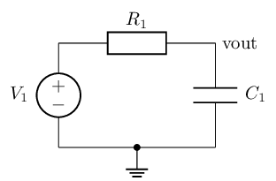

# spice2tikz

`spice2tikz` converts circuit descriptions — SPICE netlists and LTspice
`.asc` schematics — into publication-quality
[CircuiTikZ](https://ctan.org/pkg/circuitikz) LaTeX code, so that circuits
that already exist in machine-readable form do not have to be redrawn by
hand for a paper, thesis, or lecture note. Conversion runs through two
JSON intermediate representations: a *Netlist IR* (logical connectivity)
and a *Schematic IR* (placed components on an integer grid). The Schematic
IR can be dumped, hand-tweaked, and re-emitted, and the whole pipeline is
deterministic — the same input always produces byte-identical output, so
generated `.tex` diffs cleanly in version control.

**Status: pre-alpha, under active development.** The Schematic IR → CircuiTikZ
half of the pipeline works today: hand-written or generated Schematic IR JSON
converts to a `.tex` snippet or a compilable standalone document. The importers
(LTspice `.asc`, SPICE netlist) and the automatic layout engine are next — see
`docs/ROADMAP.md`.

## Features

| Stage | What it does | Status |
|---|---|---|
| Netlist IR | logical connectivity: components, pins, nets, subcircuits | ✅ 0.0.2 |
| Schematic IR | placed components, wires, junctions, labels on an integer grid | ✅ 0.0.2 |
| Symbol library | pin geometry for `nmos`, `pmos`, `npn`, `pnp` incl. rotation/mirror | ✅ 0.0.2 |
| Validation | the 13 IR invariants of `docs/SPEC_IR.md` §4, as errors and warnings | ✅ 0.0.2 |
| CircuiTikZ emitter | IR → `.tex` snippet or standalone document | ✅ 0.0.3 |
| LTspice `.asc` import | schematic capture → Schematic IR, geometry preserved | planned (§3) |
| SPICE netlist parser | `.sp`/`.cir`/`.net` → Netlist IR | planned (§4) |
| Layout engine | Netlist IR → Schematic IR (automatic placement and routing) | planned (§5) |

Explicit non-features: no simulation, no netlist editing, no AI/heuristic
"redrawing" of arbitrary images, no GUI.

## Requirements

- Python ≥ 3.10
- No runtime dependencies (standard library only)

## Install from source

```sh
git clone https://github.com/PeterJones7/spice2tikz.git
cd spice2tikz
python -m pip install -e .
```

For development (pytest, ruff, mypy):

```sh
python -m pip install -e ".[dev]"
```

Check the installation:

```sh
spice2tikz --version
```

## Usage so far

Convert a Schematic IR file to CircuiTikZ (format deduced from the extension,
or forced with `--from {spice,asc,netlist-ir,schematic-ir}`):

```sh
spice2tikz circuit.schematic.json > circuit.tex     # snippet, for \input
spice2tikz circuit.schematic.json -o circuit.tex    # same, without the shell
spice2tikz circuit.schematic.json --standalone      # a compilable document
spice2tikz circuit.schematic.json -q                # errors only
spice2tikz circuit.schematic.json -v                # progress and a summary
```

Style defaults can be overridden without editing the file, repeatably and from
a TOML config (see `docs/EMITTER.md` §3):

```sh
spice2tikz circuit.schematic.json --style resistor_variant=american
spice2tikz circuit.schematic.json --config style.toml
```

Exit codes: `0` ok, `1` input parse error, `2` validation error, `3`
internal error. Diagnostics go to stderr; stdout carries the generated LaTeX
and nothing else, so a redirect produces exactly the bytes `-o` would write.
Validation warnings are reported and conversion continues; validation *errors*
suppress emission, because a partly-wrong schematic is worse than a clear
failure.

## Example

This Schematic IR (the worked example from `docs/SPEC_IR.md` §5, abridged):

```json
{ "ir": "schematic", "version": "1.0",
  "meta": { "title": "RC low-pass", "grid": { "pitch": 0.5 } },
  "sheets": [ { "name": "main", "elements": [
    { "type": "component", "mode": "path", "ref": "V1", "kind": "vsource",
      "a": [0, 4], "b": [0, 0], "label": { "side": "left" } },
    { "type": "component", "mode": "path", "ref": "R1", "kind": "resistor",
      "a": [0, 4], "b": [6, 4] },
    { "type": "component", "mode": "path", "ref": "C1", "kind": "capacitor",
      "a": [6, 4], "b": [6, 0] },
    { "type": "wire", "net": "0", "points": [[0, 0], [6, 0]] },
    { "type": "net_symbol", "net": "0", "variant": "ground",
      "at": [3, 0], "rot": 0 },
    { "type": "junction", "at": [3, 0] },
    { "type": "net_symbol", "net": "out", "variant": "tap",
      "at": [6, 4], "rot": 0, "text": "vout" } ] } ] }
```

converts to this snippet:

```latex
\begin{circuitikz}[scale=0.5]
  \ctikzset{european resistors}
  \ctikzset{cute inductors}
  \draw (0,4) to[american voltage source, l_=$V_1$] (0,0);
  \draw (0,4) to[R=$R_1$] (6,4);
  \draw (6,4) to[C=$C_1$] (6,0);
  \draw (0,0) -- (6,0);
  \draw (3,0) node[ground]{};
  \draw (3,0) node[circ]{};
  \node[right] at (6,4) {vout};
\end{circuitikz}
```

which renders as:



## Development

```sh
ruff check .            # lint
ruff format --diff      # formatting
mypy                    # type-check src/ in strict mode
pytest                  # test suite
pytest --update-golden  # regenerate tests/golden/ after an intended change
```

`tests/test_compile.py` compiles every standalone golden with `latexmk`; it is
skipped automatically when no LaTeX toolchain is installed, and always runs in
CI inside a TeX Live container. After regenerating goldens, render and look at
them before accepting the diff:

```sh
python tools/render_goldens.py
```

## Documentation

- `docs/DESIGN.md` — motivation, architecture, design decisions
- `docs/SPEC_IR.md` — the two intermediate representations
- `docs/EMITTER.md` — emission rules, style options, how to add a symbol
- `docs/ROADMAP.md` — implementation plan
- `docs/DECISIONS.md` — log of small implementation decisions

## License

MIT — see [LICENSE](LICENSE).
